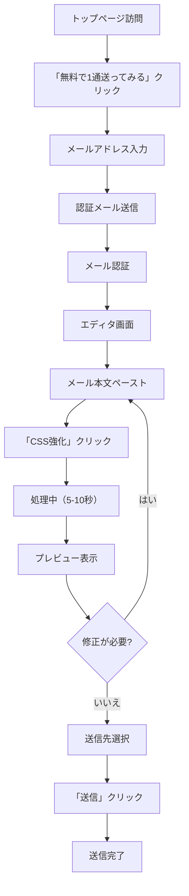
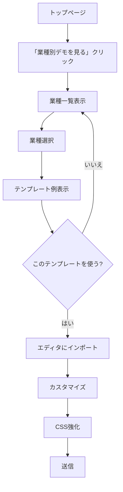
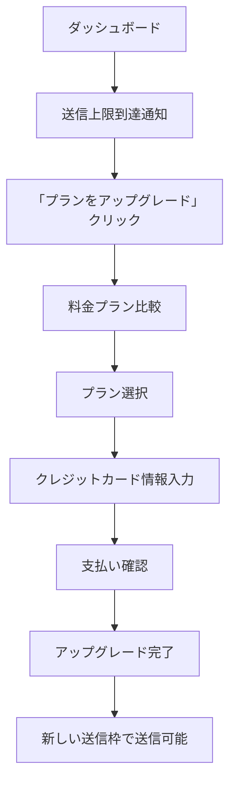
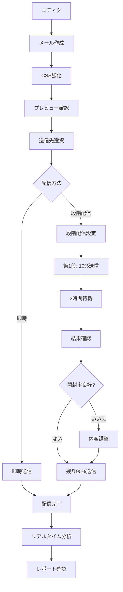
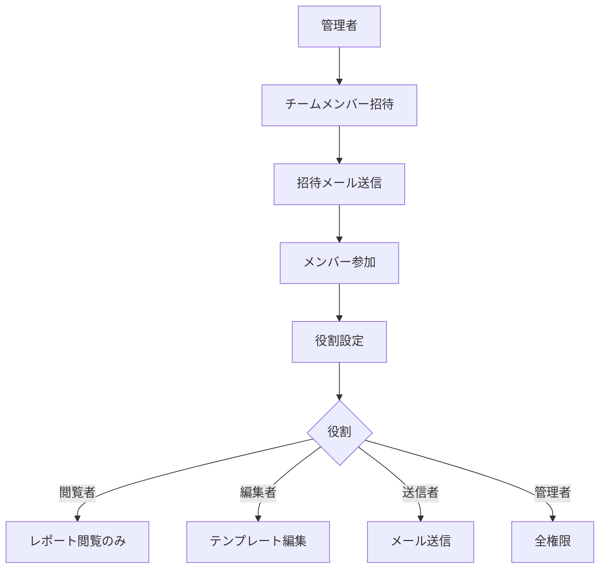

# ユーザーフロー

## 1. 新規ユーザー登録 → 最初のメール送信



### 所要時間目標
- 合計: 30秒以内（認証除く）
- CSS強化: 5-10秒
- プレビュー表示: 即座

## 2. 業種別テンプレート選択



## 3. 有料プランへのアップグレード



## 4. メール作成 → 配信 → 分析



## 5. チーム機能（スケールプラン以上）



## 主要画面遷移

### トップページ
```
Header
├── ロゴ
├── ナビゲーション（機能、業種別、料金、ドキュメント）
└── CTA（ログイン、無料で始める）

Hero
├── キャッチコピー
├── 説明文
├── CTA（無料で1通送ってみる、業種別デモを見る）
└── トラストインジケーター

Features（主要機能）
IndustryDemo（業種別デモ）
Pricing（料金プラン）
CTA（最終アクション）
Footer
```

### エディタ画面（今後実装）
```
Header
├── ロゴ
├── 保存ステータス
└── ユーザーメニュー

Sidebar
├── テンプレート一覧
├── 送信履歴
└── 設定

Main Editor
├── 件名入力
├── 本文エディタ
├── CSS強化ボタン
└── ツールバー

Preview Pane
├── デバイス切り替え（PC/モバイル）
├── メールクライアント選択
└── プレビュー表示

Action Bar
├── 下書き保存
├── テスト送信
└── 送信
```

## エラーハンドリング

### CSS強化失敗時
1. エラーメッセージ表示
2. 「再試行」ボタン提供
3. 元のテキストは保持
4. サポートリンク表示

### 送信失敗時
1. 失敗理由の明示
2. 修正方法の提示
3. 下書きとして自動保存
4. 再送信オプション

## アクセシビリティ

- キーボードナビゲーション対応
- スクリーンリーダー対応
- 十分なコントラスト比
- フォーカスインジケーター
